# 🖼️ Manejo de Imágenes en REMAC

Documento de referencia técnica: cómo se suben, comprimen, guardan y muestran todas las imágenes del sistema (fotos de mascota, fotos de perfil, íconos/logos del sitio, imágenes de artículos). Pensado para poder explicar este apartado a detalle — por ejemplo, en la defensa del proyecto ante un asesor o profesor.

---

## 1. Resumen ejecutivo

**REMAC no guarda las imágenes como archivos en el servidor.** Todas las imágenes que sube un usuario (foto de una mascota, foto de perfil, logos del sitio, imágenes dentro de un artículo) se convierten en el propio navegador a **texto Base64** y se guardan **directo dentro de una columna de la base de datos MySQL**, junto con el resto de los datos de esa fila.

No existe una carpeta `uploads/` en el servidor, no hay ningún endpoint tipo `POST /api/upload-image`, y no hay ninguna URL de imagen tipo `https://tumascota.../fotos/123.jpg`. Cuando el navegador necesita mostrar una imagen, no hace una petición HTTP para descargarla — el texto Base64 ya viene incluido en la respuesta JSON de la API (junto con el nombre, teléfono, etc.) y el navegador lo pone directo como el `src` de una etiqueta ``.

Esta decisión de arquitectura fue deliberada, no un descuido — se explica el porqué en la sección 4.

---

## 2. El mecanismo general, paso a paso

Aunque hay 4 lugares distintos donde se suben imágenes en el sitio (sección 3), **todos siguen el mismo patrón técnico**, con solo los números (tamaño máximo, calidad) cambiando según el caso:

```mermaid
flowchart LR
    A["Usuario elige un archivo\n(&lt;input type='file'&gt;)"] --> B["FileReader.readAsDataURL()\nlee el archivo en el navegador"]
    B --> C["Se crea una imagen &lt;img&gt;\ntemporal en memoria\npara conocer su ancho/alto reales"]
    C --> D["Se dibuja en un &lt;canvas&gt;\noculto, más pequeño\n(máx. 300-600px según el caso)"]
    D --> E["canvas.toDataURL('image/jpeg', 0.85)\nexporta el canvas ya reducido\ncomo un NUEVO Base64, más chico"]
    E --> F["Ese Base64 final se manda\nen el body JSON de la petición\n(fetch) a la API en PHP"]
    F --> G["PHP guarda el Base64\ntal cual, como texto,\nen una columna LONGTEXT de MySQL"]
    G --> H["Al mostrarla después,\nel Base64 viaja en la\nrespuesta JSON normal\nde la API — no hay una\npetición aparte por la imagen"]
    H --> I["El navegador lo pone\ndirecto en &lt;img src='data:image/jpeg;base64,...'&gt;"]
```

Puntos clave de este flujo:

- **Todo el procesamiento de la imagen pasa en el navegador del usuario (JavaScript), no en el servidor.** PHP nunca "ve" el archivo original ni lo redimensiona — solo recibe el texto ya comprimido y lo guarda.
- **El `<canvas>` es el truco central.** Es un elemento HTML5 normal, invisible, que existe solo un instante en memoria: se le "dibuja" la imagen ya encogida al tamaño máximo permitido, y `toDataURL()` convierte ese dibujo de vuelta a una cadena de texto (Base64) — pero ahora mucho más chica que el archivo original, porque tiene menos píxeles y además se comprime como JPEG con una calidad del 85% (un balance entre verse bien y pesar poco).
- **Base64 es solo una forma de representar datos binarios (una foto) como texto**, para que quepa dentro de un campo de texto normal de la base de datos y dentro de un JSON. La contra es que ocupa **~33% más espacio** que el archivo binario original — por cada 3 bytes de la imagen real, Base64 usa 4 caracteres de texto.
- **La imagen final que se guarda empieza con un "prefijo" como `data:image/jpeg;base64,`** — ese prefijo le dice al navegador qué tipo de archivo es antes del propio contenido codificado. Por eso simplemente poniendo ese texto completo como `src="..."` de un ``, el navegador ya sabe cómo interpretarlo y mostrarlo, sin necesitar descargarlo de ningún lado.

---

## 3. Cada tipo de imagen, en detalle

| Imagen | Dónde se sube (archivo/función) | Dónde se guarda (tabla.columna) | Tamaño máx. antes de comprimir | Se redimensiona a | Calidad JPEG |
|---|---|---|---|---|---|
| Foto de una mascota | `dashboard.html` / `asistente.html` → `previewPhoto()` | `mascotas.foto_url` (LONGTEXT) | 5 MB | 600 px (el lado más largo) | 0.85 |
| Foto de perfil (ciudadano, asistente o admin/superadmin) | `dashboard.html` / `admin.html` / `asistente.html` → `changeAvatar()` | `duenos.foto_perfil` (LONGTEXT) | 5 MB | 300 px | 0.85 |
| Íconos/logos del sitio (navbar, hero, banner, footer, logo del panel admin) | `admin.html` → `handleIconFile()` (pestaña "Apariencia e íconos") | `site_config.padron_appearance_config` (columna LONGTEXT, contiene un JSON) | Sin tope explícito en el archivo, pero se redimensiona igual | 400 px | 0.85 |
| Imagen de fondo de un aviso/campaña | `admin.html` → pestaña "Avisos y promociones" | también dentro de `site_config` (clave `padron_avisos`) | — | — | — |
| Imagen insertada dentro de un artículo (editor de texto) | `admin.html` → `insertImageInEditor()` | directo en `articulos.contenido` (columna **TEXT**, mezclada con el HTML del artículo) | 2 MB | **No se redimensiona** | — (se usa el archivo tal cual) |
| Logos institucionales fijos (escudo del Ayuntamiento, "Ciudad Mágica", etc.) | *(no se suben — vienen ya incluidos en el proyecto)* | **Archivos reales** en `web/Imagenes/` | — | — | — |

La última fila es la única excepción real: esos logos **no pasan por este sistema en absoluto** — son archivos `.png` normales que ya vienen dentro del proyecto (`web/Imagenes/LOGO 1.png`, etc.) y se referencian con una ruta normal (``), exactamente como en cualquier sitio web tradicional. La diferencia es que esos no los sube un usuario desde el panel — son parte fija del diseño institucional.

### 3.1 Los íconos de "Apariencia" también admiten otras 2 formas, sin Base64
Vale la pena aclarar que el selector de "Apariencia e íconos" del panel admin no *siempre* usa Base64 — admite 3 tipos de entrada, guardados en el mismo JSON con un campo `type`:
- `{type:'emoji', value:'🐾'}` — un emoji, es solo un carácter de texto normal.
- `{type:'image', value:'data:image/...;base64,...'}` — una imagen subida desde el equipo (el caso de esta sección, sí pasa por Canvas).
- `{type:'gif', value:'https://media.giphy.com/...'}` — un GIF o imagen por URL externa; aquí no se guarda ninguna imagen, solo el enlace de texto, y es el navegador del visitante el que la descarga directo desde esa URL externa cada vez.

---

## 4. ¿Por qué Base64-en-la-base-de-datos y no archivos en el servidor?

Esta es probablemente la pregunta más natural que puede hacer un asesor ("¿por qué no simplemente subir el archivo y guardar la ruta?", que es el enfoque más común). La respuesta corta: **por las limitaciones reales del hosting de este proyecto (HostGator, plan compartido, sin acceso SSH)** combinado con la decisión de construir todo el proyecto **sin ningún paso de build ni framework** (HTML/CSS/JS planos + PHP nativo).

### Ventajas de este enfoque (por qué se eligió)
- **No hace falta programar un endpoint de subida de archivos aparte** (`move_uploaded_file()`, validar tipos MIME reales, generar nombres únicos para evitar que un archivo sobrescriba a otro, etc.) — toda imagen se manda igual que cualquier otro campo de texto del formulario.
- **No hace falta gestionar permisos de carpetas en el servidor.** En hosting compartido, configurar bien los permisos de escritura de una carpeta de subidas (ni muy abiertos por seguridad, ni tan cerrados que PHP no pueda escribir) es una fuente común de errores difíciles de depurar sin acceso SSH.
- **Un respaldo de la base de datos ya incluye todas las imágenes automáticamente** — no hay que acordarse de respaldar dos cosas por separado (BD + carpeta de archivos).
- **Funciona igual sin importar el hosting**, sin configuración especial — coherente con el resto del proyecto, que evita cualquier dependencia del entorno.

### Desventajas (el costo real de esta decisión)
- **Cada imagen ocupa ~33% más espacio** en Base64 que el mismo archivo guardado tal cual (por cómo funciona esta codificación).
- **La base de datos crece mucho más rápido** de lo que crecería si las imágenes fueran archivos aparte — esto importa porque los planes de hosting compartido normalmente tienen un límite de tamaño de base de datos.
- **No se puede aprovechar el cache de imágenes del navegador ni un CDN.** Un archivo `foto.jpg` normal, el navegador lo descarga una vez y lo reutiliza en visitas futuras sin volver a pedirlo; un Base64 incrustado en el JSON se vuelve a mandar completo cada vez que se pide esa fila de datos.
- **Cada respuesta de la API pesa más** (trae la imagen incluida siempre, aunque a veces no se vaya a mostrar de inmediato).

### Por qué, aun así, fue la elección correcta para este proyecto en concreto
El volumen esperado es el de un municipio pequeño (El Grullo), no una red social con millones de fotos — y el equipo de desarrollo es pequeño, sin infraestructura de servidor propia más allá del hosting compartido básico. Para ese contexto, la simplicidad de "todo vive en una sola base de datos, sin nada más que configurar" pesa más que la eficiencia de almacenamiento que sí importaría a mayor escala.

---

## 5. Límites técnicos y validaciones

- **Límite de tamaño de archivo, revisado en JavaScript antes de procesar nada:** 5 MB para foto de mascota y de perfil, 2 MB para imágenes de artículo. Si se pasa, se rechaza con un aviso antes de siquiera leer el archivo.
- **Tipo de columna en MySQL — por qué importa:** `LONGTEXT` en MySQL admite hasta ~4 GB de texto, más que suficiente para cualquier imagen ya comprimida (normalmente quedan en decenas o pocos cientos de KB). Pero **`TEXT` (sin "LONG") solo admite ~64 KB** — ese es justo el bug real que se explica en la sección 6.
- **Límite adicional, fuera del control de este código:** el propio PHP tiene los parámetros `upload_max_filesize` y `post_max_size` (configurados en el servidor, no en el código del proyecto) que limitan qué tan grande puede ser una petición HTTP completa. En HostGator (hosting compartido) estos valores los define el proveedor; si algún día una imagen "no se guarda" sin ningún error claro de la aplicación, vale la pena revisar esto también.
- **Validación de servidor sobre `foto_perfil` (la más reciente, agregada en la función de "Mi perfil"):** aunque el navegador ya redimensiona la imagen, el servidor también rechaza cualquier valor de más de 3,000,000 de caracteres como respaldo — por si alguna vez se llama a la API directo, sin pasar por la interfaz.

---

## 6. Caso de estudio: un bug real ya corregido, y uno real todavía pendiente

### ✅ Ya corregido — `mascotas.foto_url` (1 de agosto de 2026)
Al principio, esa columna era `TEXT` (límite ~64 KB). Una foto de mascota subida **sin optimizar** (antes de que existiera el redimensionado con Canvas) fácilmente superaba ese límite. Cuando eso pasaba: MySQL rechazaba el `INSERT` → PDO (la librería de PHP para hablar con la base de datos) lanzaba una excepción → PHP, sin manejarla, devolvía una página de error en **HTML** en vez de la respuesta **JSON** que el navegador esperaba → el navegador tronaba con el error `Unexpected token '<'` (porque intentaba leer HTML como si fuera JSON). Se corrigió cambiando la columna a `LONGTEXT` y agregando el redimensionado por Canvas antes de guardar.

### ⚠️ Pendiente — `articulos.contenido` tiene exactamente el mismo problema
Revisando este apartado a fondo se encontró que `insertImageInEditor()` (la imagen que se puede insertar dentro de un artículo desde el editor de texto) **nunca se redimensiona** — solo se rechaza si el archivo original pesa más de 2 MB, pero se usa tal cual, sin pasar por `<canvas>`. Y la columna `articulos.contenido` sigue siendo `TEXT` (el mismo límite de ~64 KB), no `LONGTEXT`. Cualquier imagen de más de ~45-48 KB insertada en un artículo muy probablemente falle al guardarse, con el mismo tipo de error de la sección anterior. **Este documento describe el sistema tal como está hoy — incluyendo este pendiente — a propósito, para que la explicación sea honesta y no dé a entender que ya está resuelto.**

---

## 7. Preguntas que te puede hacer un asesor (y respuesta corta)

**¿Por qué no usaron una carpeta de `uploads/` como cualquier sitio con imágenes?**
Por las limitaciones del hosting compartido (HostGator, sin SSH) y porque el proyecto completo evita cualquier paso de configuración de servidor más allá de subir archivos y una base de datos — es la misma filosofía "sin build, sin dependencias" aplicada también a las imágenes.

**¿No es ineficiente guardar imágenes como texto en la base de datos?**
Sí, un poco (~33% más pesado que el archivo original), pero para el volumen esperado (un municipio pequeño) el costo es aceptable comparado con la simplicidad que gana el proyecto al no tener que gestionar archivos por separado.

**¿Qué pasa si alguien sube una foto enorme?**
Se rechaza en el navegador antes de procesarla si excede el límite (5 MB para fotos de mascota/perfil, 2 MB para artículos), y las que sí se aceptan se redimensionan a un tamaño mucho menor (300-600 px) antes de guardarse — excepto las de artículos, que es el pendiente de la sección 6.

**¿Cómo se relacionan estas imágenes con las fotos de mascota o de perfil que ya existen?**
Cada fila de `mascotas` y de `duenos` tiene su propia columna de foto — la imagen "pertenece" directamente a ese registro, no hay una tabla aparte de "archivos" ni relación por separado que gestionar.
